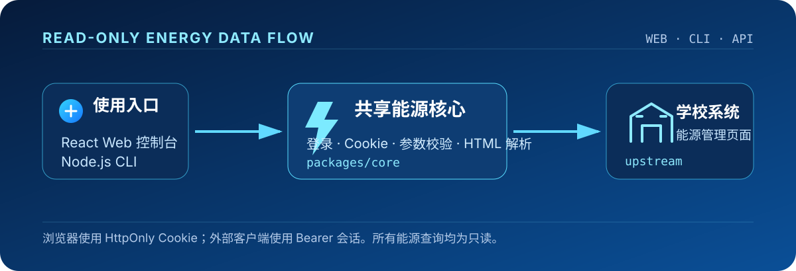

<p align="center">
  
</p>

<p align="center"><strong>把学校能源管理页面转换为可靠、只读的 Web API 与命令行体验。</strong></p>

<p align="center">
  <a href="https://sd.wic.edu.kg/"></a>
  <a href="https://sd.wic.edu.kg/docs.html"></a>
  <a href="https://sd.doc.wic.edu.kg/"></a>
</p>

<p align="center">
  
  
  
  
  
  
  <a href="./LICENSE"></a>
</p>

<p align="center"><a href="#能力一览">能力一览</a> · <a href="#快速开始">快速开始</a> · <a href="#系统设计">系统设计</a> · <a href="#api-速览">API</a> · <a href="#部署">部署</a></p>

---

## 能力一览

WIC Energy 面向需要查询宿舍用电余额、趋势与缴费记录的使用者。它将学校能源管理站点的登录和查询过程收敛为一套类型安全的共享核心，同时提供浏览器控制台、标准 JSON API 和 CLI。

| 图标 | 能力 | 说明 |
| :--: | --- | --- |
| ⚡ | **能源数据查询** | 账户余额、月度/每日/72 小时用电、缴费和月补记录一站式获取。 |
| 🛡️ | **会话边界清晰** | 密码只用于本次登录；浏览器使用 HttpOnly Cookie，外部客户端使用 Bearer 会话。 |
| 🚀 | **短时数据缓存** | 浏览器会话内缓存查询结果 5 分钟；刷新页面优先复用，主动查询仍获取最新数据。 |
| 🧭 | **三种入口** | React 控制台、OpenAPI 文档与 CLI 共用同一套校验、登录和解析逻辑。 |
| 📊 | **面向阅读的结果** | Web 端提供图表、表格与原始 JSON 展开；CLI 适合自动化与终端工作流。 |
| 🔒 | **严格只读** | 不调用支付、改密、开关、绑定或学校注销等任何状态变更接口。 |

> [!IMPORTANT]
> 学校上游仍使用 HTTP。本站 HTTPS 不能消除到学校系统这一段链路的明文风险；请只在可信网络和设备上登录。

## 快速开始

### 1. 启动本地 Web 控制台

需要 **Node.js 22+**。

```bash
npm ci
npm run dev:web
```

打开 [http://127.0.0.1:3000](http://127.0.0.1:3000)。登录页、接口文档分别位于 `/login.html` 和 `/docs.html`。

### 2. 使用命令行

```bash
npm run cli -- login
npm run cli -- account
```

CLI 直接访问学校系统，不需要先运行 Web 服务。首次登录后按提示保存本地会话；需要非交互自动化时可使用 CLI 支持的 `--cookie` 参数。

### 3. 验证工程

```bash
npm run check
```

该命令会构建核心、Web 和 CLI，并执行 workspace 测试。

## 系统设计

<p align="center"></p>

| 层级 | 位置 | 职责 |
| --- | --- | --- |
| 🖥️ Web | `apps/web` | React 客户端、Express API、Node/Vercel 入口与静态页面。 |
| ⌨️ CLI | `apps/cli` | 交互登录、会话管理与终端查询适配。 |
| ⚙️ Core | `packages/core` | Cookie 请求、参数校验、领域类型、学校页面解析与查询串行化。 |

API 响应采用稳定结构：成功时为 `{data, meta}`，失败时为 `{error}`。`meta` 会包含数据来源、获取时间与实际查询参数，便于前端或自动化脚本追踪数据上下文。

## API 速览

先通过登录接口获取学校会话。浏览器会将会话安全地保存在本站 HttpOnly Cookie；外部 API 客户端应通过 `Authorization: Bearer` 传递会话值。

```http
POST /api/login
Content-Type: application/json

{"username":"学校账号","password":"密码"}
```

```http
GET /api/account
Authorization: Bearer JSESSIONID=学校会话值
```

| 分组 | 路径 | 用途 |
| --- | --- | --- |
| 🩺 服务 | `GET /api/health` | 健康检查。 |
| 🔐 会话 | `POST /api/login` · `POST /api/logout` · `GET /api/user` | 登录、退出和会话验证。 |
| 💳 账户 | `GET /api/account` · `GET /api/usage/overview` | 账户摘要和用电概览。 |
| 📈 用电 | `GET /api/months` · `/api/usage/monthly` · `/api/usage/daily` · `/api/usage/hourly` | 月份、月度、日度与 72 小时数据。 |
| 🧾 流水 | `GET /api/payments` · `GET /api/subsidies` | 缴费与月补记录。 |

完整请求参数、错误码和在线调试入口请参阅 [接口文档](https://sd.wic.edu.kg/docs.html)、[OpenAPI 3.0 规范](https://sd.wic.edu.kg/api/openapi.json) 或 [Apifox](https://sd.doc.wic.edu.kg/)。

## 部署

### Docker

```bash
docker compose up --build -d
```

容器默认暴露 `3000` 端口，每位用户在页面中完成自己的学校账户登录。

### Vercel

导入仓库时选择以下配置：

| 配置项 | 值 |
| --- | --- |
| Root Directory | 仓库根目录 `.` |
| Framework Preset | `Other` |
| Node.js | `22.x` |
| Install Command | `npm ci` |
| Build Command | `npm run build:web` |
| Output Directory | `apps/web/dist/client` |

项目无需账户或会话密钥环境变量。可选服务端参数见 [`.env.example`](./.env.example)：`WIC_BASE_URL` 与 `WIC_TIMEOUT_MS` 不要使用 `VITE_` 前缀。

## 项目结构

```text
wic-energy/
├── apps/
│   ├── web/           # React 控制台 + Express API + Vercel 入口
│   └── cli/           # 命令行客户端
├── packages/
│   └── core/          # 登录、校验、类型与页面解析
├── testing/           # 本地模拟学校服务与测试支撑
└── assets/readme/     # README 品牌与架构视觉资源
```

## 安全与使用边界

- 不在配置、日志或 Git 中保存学校账号密码；密码仅用于当前登录请求。
- 会话失效时 API 返回 `401`，请重新登录；浏览器退出仅清理当前本站 Cookie，不会注销其他副本。
- 同一学校会话的报表查询会在单个进程内串行执行，以避免上游并发异常；跨 Vercel 实例仍应避免并发复用同一 Cookie。
- 这是读取能源数据的工具，不包含支付、改密或其他学校账户状态变更能力。

## License

本项目采用 [MIT License](./LICENSE) 开源。
